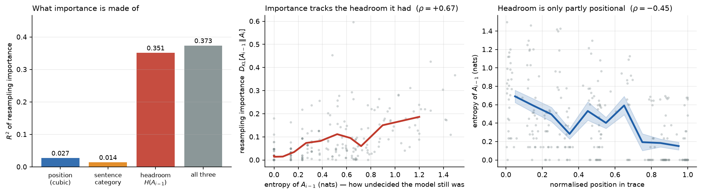
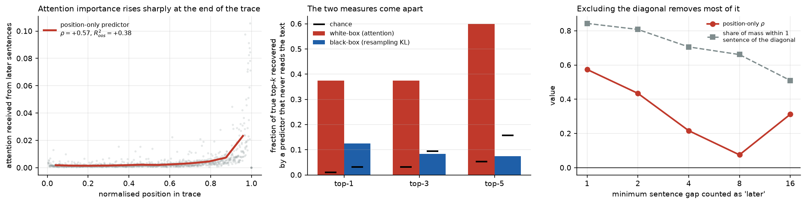

# What resampling importance actually measures

Code and data for a red-team of the black-box **thought anchors** measure
(Bogdan, Macar, Nanda & Conmy), testing whether sentence-level resampling
importance is confounded by a sentence's **position** in the reasoning trace.

**It is not.** The measure survives that confound. What it is dominated by
instead is how undecided the model still was when the sentence arrived.

> Regressing importance on candidate explanations (254 sentences): headroom
> $H(A_{i-1})$ explains $R^2 = 0.351$, against $0.027$ for position and $0.014$
> for sentence category. Headroom uniquely adds $+0.334$ over the other two
> combined, and is not position in disguise ($\rho = -0.45$ with position).

Setting: **DeepSeek-R1-Distill-Qwen-14B** on MATH-500, the model the method was
built on. 8 traces, 254 sentences, 64 rollouts per prefix boundary.



## The measure

For a trace with sentences $S_0 \dots S_{n-1}$, let $A_i$ be the distribution
over final answers when the model continues from the prefix that **includes**
$S_i$, and $A_{i-1}$ the distribution when it stops **before** $S_i$, so the
model resamples its own replacement $T_i$:

$$\mathrm{imp}_r(i) = D_{\mathrm{KL}}\big[\,p(A_{i-1}) \,\|\, p(A_i)\,\big]$$

$$\mathrm{imp}(i) = D_{\mathrm{KL}}\big[\,p(A_{i-1} \mid T_i \nsim S_i) \,\|\, p(A_i)\,\big]$$

The second is *counterfactual importance*, which keeps only rollouts whose
replacement was semantically different from the original ($\cos < 0.8$ under
`all-MiniLM-L6-v2`, matching the original work).

Note that $A'_i$ and $A_{i-1}$ are the same object, both being the rollouts
launched from prefix $S_{<i}$. One sweep over the $n+1$ prefix boundaries
therefore yields every importance in the trace.

## Results

| # | Finding | Evidence |
|---|---|---|
| 1 | Importance is **not** positional | $\rho = +0.044$ ($p = 0.48$); top-3 recovery **0.083 vs chance 0.095** |
| 2 | It tracks **how undecided the model was** | $R^2 = 0.351$ vs $0.027$ (position), $0.014$ (category) |
| 3 | The categorical claim survives too | category is strongly positional (Kruskal $p = 1.2 \times 10^{-13}$) yet shared $R^2 = 0.001$ |
| 4 | White-box receiver heads are **recency** | **84%** of their attention mass within one sentence of the diagonal |
| 5 | The semantic filter does nothing detectable | different $0.103$ vs similar $0.119$; gap $-0.016$, CI $[-0.081, +0.040]$ |
| 6 | The method does not reach current models | about **11 H200-hours per trace** on Olmo-3-Think and Qwen3-8B |

### The white-box arm, and the error in it

The original work offers black-box and white-box agreement as mutual
corroboration. Reimplementing the white-box side (receiver heads, 48 layers by
40 heads) gave the largest effect in the study, $\rho = +0.574$ with top-3
recovery at 12x chance. Plotting the attention matrix showed why: 84% of those
heads' attention mass lies within one sentence of the diagonal. They are recency
heads, not the long-range broadcasting heads the account describes. Excluding a
band around the diagonal collapses the effect.



## Start here: four notebooks, no GPU required

Each runs **CPU-only in seconds** from data committed to this repo. No model
download, no API key, no GPU. Outputs are saved, so they are readable on GitHub
without running anything.

| Notebook | What it does |
|---|---|
| [`01_reproduce_headline`](notebooks/01_reproduce_headline.ipynb) | Re-derives the variance decomposition from scratch, the position-only control, the noise floor, the paraphrase contrast |
| [`02_look_at_the_data`](notebooks/02_look_at_the_data.ipynb) | Segmentation, answer extraction and labelling, with randomly selected examples. Recomputes an importance value by hand and checks it against the pipeline |
| [`03_instrument_validation`](notebooks/03_instrument_validation.ipynb) | Six pass conditions declared before running, on planted ground truth |
| [`04_whitebox_recency`](notebooks/04_whitebox_recency.ipynb) | The white-box arm and the min-gap correction |

```bash
pip install -r requirements.txt
jupyter lab notebooks/
```

If you only run one, run the first. If you want to know whether to believe it,
run the third: it is the argument that the instrument works.

## Controls

Three controls were built. The **position-only predictor** sees only a sentence's
normalised position and never reads the text. The **paraphrase arm** holds
position fixed and preserves content: it is free, being the complement of the
semantic filter above, the rollouts the published measure discards.

**The third, a filler arm, was withdrawn.** A pre-registered check found the filler sits
$-7.61\sigma$ from the model's own sentences, where a deliberately alien sentence
sits at $-11.68\sigma$, and it was more likely than the real sentence in 0 of 120
slots. It measured disruption rather than absence of content, so its result does
not bear on the question. See `10_filler_indistribution.py`.

## Reproducing the full pipeline

Python 3.12, one H200-class GPU. The engine runs vLLM in-process. See
`slurm/_common.sh` for node-specific details, including a CUDA 11.8 and Hopper
incompatibility that requires pointing `CUDA_HOME` at the toolkit bundled in the
torch wheels.

```bash
make sim         # instrument validation on planted ground truth
make traces      # select problems on answer entropy, generate base traces
make resample    # the prefix sweep, ARM=main
make filler      # the content control, ARM=filler
make analyze     # importance and all controls, writes data/sentences_*.csv
make labels categories figures examples report
```

On a cluster use `slurm/` instead; `slurm/run_pipeline.sh` chains the stages with
`afterok` dependencies.

### Attention tensors

The white-box arm writes per-trace attention as `data/attn_*.npy` with shape
`[layers, heads, sentences, sentences]`. These are excluded from the repo: they
total 591 MB and two exceed GitHub's 100 MB file limit. Regenerate with:

```bash
python code/11_internals.py --model deepseek-ai/DeepSeek-R1-Distill-Qwen-14B --max-traces 8
python code/14_mingap_sweep.py --model deepseek-ai/DeepSeek-R1-Distill-Qwen-14B
```

Everything else needed to reproduce every number is already in `data/`.

## Layout

| Path | Contents |
|---|---|
| `code/anchors/` | Library: segmentation, answer normalisation, importance estimators and noise floor, position baseline, rollout engine, simulator |
| `code/*.py` | Pipeline stages, numbered in execution order |
| `notebooks/` | Four CPU-only reproduction notebooks |
| `slurm/` | Cluster submission scripts |
| `data/` | Screening, length probes, traces, raw rollouts, per-sentence CSV, summary JSON |
| `figures/` | The nine figures from the report |

## Design decisions that carry weight

- **Prefixes are exact slices.** Segmentation returns character spans, so a
  rollout prompt is literally `thinking[:span.end]`, the bytes the model
  produced. Nothing is re-rendered. There is a tiling assertion for this.
- **`<none>` is an outcome, not a wrong answer.** A rollout that exhausts its
  budget is labelled separately. Folding it into "incorrect" would build a
  positional trend into the data by hand.
- **Rollouts are unseeded.** A fixed `SamplingParams.seed` makes vLLM
  deterministic per prompt: 24 identical requests returned the same 8
  completions.
- **Windowed sampling.** Six windows of four consecutive sentences measure the
  same sentence-level quantity on a random subsample rather than coarsening the
  unit: 55 prefixes instead of 517, 42M tokens instead of 271M.
- **Every divergence is reported against its finite-sample floor**, estimated by
  parametric bootstrap under the null that the sentence did nothing. The
  position predictor is fit leave-one-trace-out, and all confidence intervals
  use a cluster bootstrap over traces.

## Limits

- **8 traces, 254 sentences.** The constraint is answer dispersion, not compute:
  entropy is exactly zero for 84% of the 140 problems screened.
- **61% of sentences clear their own noise floor** at $R = 64$. The pooled and
  variance-decomposition results are defensible; per-sentence rankings are not.
- **A null is not proof of absence.** $|\Delta P(\text{correct})|$, a
  lower-variance statistic, does show a positional effect ($\rho = +0.237$), so
  this bounds a positional component rather than excluding one.
- **The white-box long-range result is unresolved**, being non-monotone in
  minimum sentence gap, and at 8 traces structure cannot be separated from noise.

Eight predictions with numeric confidences were written and hashed before any
importance number existed on a real trace. Final score: 3 right, 4 wrong, 1
partial, including both of the two held with highest confidence.
